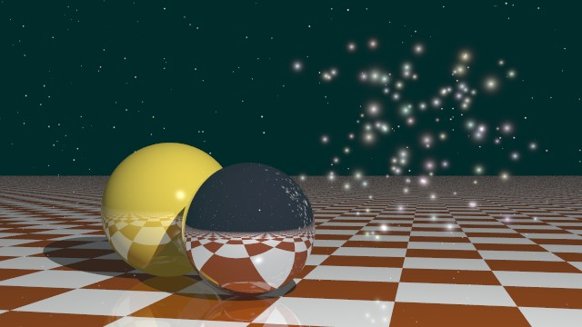

# Extension: ParticleSimulator



### Author: Josef Pelikan

### Category: Support class

### Namespace: JosefPelikan

### Class name: ParticleSimulator

### ITimeDependent: No

### Source file: ParticleSimulator.cs

This extension demonstrates how a "simulator" can create a shared data for the whole animation
in a pre-processing stage. It is able to compute control point data (e.g. for Catmull-Rom spline interpolation)
for arbitrary number of controlled objects (particles) and arbitrary number of knots.

An example shows generation of data arrays for the ``ChaoticParticles`` object. Particles are generated in a
lmited space, animated randomly (position, size and color).

A ``context`` item than holds result object which can be later shared by a number of independent
rendering threads.

Setting simulator parameters is done via a map, for example:
```
Dictionary&lt;string, object&gt; par = new Dictionary&lt;string, object&gt;
{
  { ParticleSimulator.PARTICLES,  100 },
  { ParticleSimulator.CENTER,     new Vector3(0.0f, 0.0f, 0.0f) },
  { ParticleSimulator.RADIUS,     4.0f },
  { ParticleSimulator.POS_NAME,   namePos },
  { ParticleSimulator.COLOR_NAME, nameColor },
  { ParticleSimulator.MIN_SIZE,   0.1f },
  { ParticleSimulator.MAX_SIZE,   0.5f },
  { ParticleSimulator.MIN_COLOR,  0.6f },
  { ParticleSimulator.MAX_COLOR,  1.0f },
};

```
## Examples

Sample animated scene is in the ``ParticleSimulationScene.cs`` script. It needs three
more modules: ``StarBackground.cs``, ``CatmullRomAnimator.cs`` and ``ChaoticParticles.cs``.

### Sample animation script: ParticleSimulationScene.cs

See the ``context[simulatorName]`` map entry keeping the already computed ``ParticleSimulator``
instance and passed it to the second phase of the scene definition where all the rendering threads
will reference it.

## Images, videos

Videosequence:

[YouTube video 640x360](https://youtu.be/IdFLjtL-UkI)
