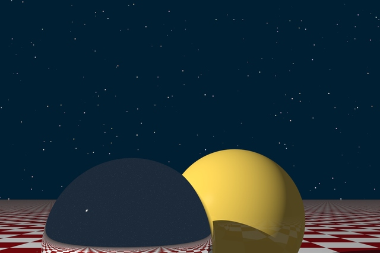

# Extension: StarBackground



### Author: Josef Pelikan

### Category: Background

### Namespace: JosefPelikan

### Class name: StarBackground : DefaultBackground

### ITimeDependent: No

### Source file: StarBackground.cs

This extensions implements an alternative scene background simulation a skydome full of stars.
Deterministic random algorithm places "stars" randomly, star properties which can
vary:

1. brightness (star "size")

2. Color

User is able to define a couple of parameters:

a. **resolution** - controls grid size = number of positions wwhich are considered for stars
   Reasonable values: between 100 and 10000

b. star-field **"density"** in form of probability (greater number means denser field)
   Reasonable values: 0.0001 to 0.5 (for very wierd appearance not similar to night sky)

c. **color range** is number from `0.0` (monochromatic) to `1.0` (full-color)
   Reasonable values: 0.1 to 0.6 (for realistic star colors)

d. **intensity** - defines maximal intensity in the middle of a star. Can be negative for
   the "negative" effect

e. **size** - star size coefficient (defines relative star diameter)

f. **rand** - random base/seed. If you want to get a different concrete star placement, change
   this from default (`0L`)

## Example

From a scene/animation definition script
```
using JosefPelikan;

...

scene.BackgroundColor = new double[] {0.0, 0.01, 0.03};
scene.Background = new StarBackground(scene.BackgroundColor, 600, 0.006, 0.5, 1.6, 1.0);
```

Here `600` is resolution, `0.006` probability (density), `0.5` color coefficient,
`1.6` intensity, `1.0` relative star size (default). Random seed is not specified,
so the default {`0L`) will be used.

### Sample scene script: TwoSpheresStars.cs

### Sample animation script: AnimatedSceneStars.cs

## Images, videos

Static image (computed from some variation of `TwoSpheresStars.cs`):

[1800x1200](https://drive.google.com/file/d/1YvHi4glIjDmnjNi6VQaeVubB4hr39SiF/view?usp=sharing)

Videosequence:

[YouTube video 800x600](https://youtu.be/Ekl_EDmuwrY)
